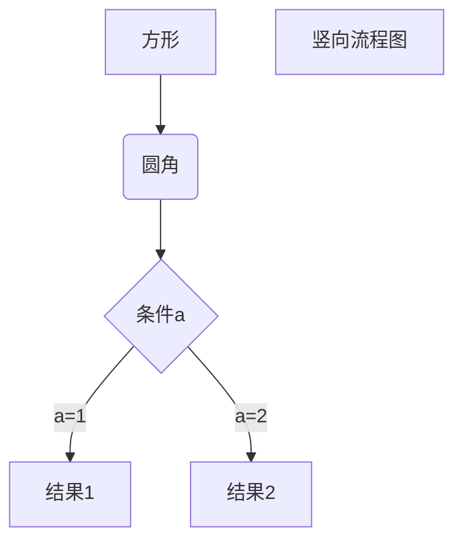

# TEST123

## 1 项目创建

### maven
```
mvn archetype:create(generate) -DgroupId=org.seckill
                       -DartifactId=seckill
                       -DarchetypeArtifactId=maven-archetype-webapp
```
### 修改servlet版本为3.1
找到 apache-tomcat-8.0.45\webapps\examples\WEB-INF\web.xml,复制它的头文件，粘贴到项目的web.xml

```xml
<web-app xmlns="http://xmlns.jcp.org/xml/ns/javaee"
         xmlns:xsi="http://www.w3.org/2001/XMLSchema-instance"
         xsi:schemaLocation="http://xmlns.jcp.org/xml/ns/javaee
                      http://xmlns.jcp.org/xml/ns/javaee/web-app_3_1.xsd"
         version="3.1"
         metadata-complete="true">

</web-app>
```
### 添加目录
file->project structure->module


添加源码文件夹和测试文件夹

## 2 依赖
junit依赖更改为4.12

### 日志
slf4j是接口，日志实现为：log4j,logback,common-logging

使用：slf4j + logback

```xml
<dependency>
  <groupId>org.slf4j</groupId>
  <artifactId>slf4j-api</artifactId>
  <version>1.7.12</version>
</dependency>

<dependency>
  <groupId>ch.qos.logback</groupId>
  <artifactId>logback-core</artifactId>
  <version>1.1.11</version>
</dependency>

<!-- 实现slf4j接口并整合 -->
<dependency>
  <groupId>ch.qos.logback</groupId>
  <artifactId>logback-classic</artifactId>
  <version>1.1.11</version>
</dependency>
```
### 数据库依赖

```
<dependency>
  <groupId>mysql</groupId>
  <artifactId>mysql-connector-java</artifactId>
  <version>5.1.42</version>
  <scope>runtime</scope>  <!--只在连接时工作-->
</dependency>
<!-- 数据库连接池 -->
<dependency>
  <groupId>c3p0</groupId>
  <artifactId>c3p0</artifactId>
  <version>0.9.1.2</version>
</dependency>
```

### DAO层 MyBatis

```
<!-- DAO框架：MyBatis -->
<dependency>
  <groupId>org.mybatis</groupId>
  <artifactId>mybatis</artifactId>
  <version>3.4.0</version>
</dependency>
<!-- mybatis自身实现的spring整合依赖 -->
<dependency>
  <groupId>org.mybatis</groupId>
  <artifactId>mybatis-spring</artifactId>
  <version>1.3.0</version>
</dependency>
```
### javaweb相关依赖

```xml
<!-- Servlet web相关依赖-->
    <dependency>
      <groupId>taglibs</groupId>
      <artifactId>standard</artifactId>
      <version>1.1.2</version>
    </dependency>
    <dependency>
      <groupId>jstl</groupId>
      <artifactId>jstl</artifactId>
      <version>1.2</version>
    </dependency>
    <dependency>
      <groupId>com.fasterxml.jackson.core</groupId>
      <artifactId>jackson-databind</artifactId>
      <version>2.8.8</version>
    </dependency>
    <dependency>
      <groupId>javax.servlet</groupId>
      <artifactId>javax.servlet-api</artifactId>
      <version>3.1.0</version>
    </dependency>
```

### Spring依赖

```
<!--Spring依赖-->
    <!--Spring核心依赖-->
    <dependency>
      <groupId>org.springframework</groupId>
      <artifactId>spring-core</artifactId>
      <version>4.3.9.RELEASE</version>
    </dependency>
    <dependency>
      <groupId>org.springframework</groupId>
      <artifactId>spring-beans</artifactId>
      <version>4.3.9.RELEASE</version>
    </dependency>
    <dependency>
      <groupId>org.springframework</groupId>
      <artifactId>spring-context</artifactId>
      <version>4.3.9.RELEASE</version>
    </dependency>
    <!--Spring dao层依赖-->
    <dependency>
      <groupId>org.springframework</groupId>
      <artifactId>spring-jdbc</artifactId>
      <version>4.3.9.RELEASE</version>
    </dependency>
    <dependency>
      <groupId>org.springframework</groupId>
      <artifactId>spring-tx</artifactId> <!--Spring 声明式事务-->
      <version>4.3.9.RELEASE</version>
    </dependency>
    <!--Spring web相关依赖-->
    <dependency>
      <groupId>org.springframework</groupId>
      <artifactId>spring-web</artifactId>
      <version>4.3.9.RELEASE</version>
    </dependency>
    <dependency>
      <groupId>org.springframework</groupId>
      <artifactId>spring-webmvc</artifactId>
      <version>4.3.9.RELEASE</version>
    </dependency>
    <!--Spring test依赖-->
    <dependency>
      <groupId>org.springframework</groupId>
      <artifactId>spring-test</artifactId>
      <version>4.3.9.RELEASE</version>
    </dependency>
```


​                                      


```flow
st=>start: Start
op=>operation: Your Operation
cond=>condition: Yes or No?
e=>end

st->op->cond
cond(yes)->e
cond(no)->op
```



```sequence
Alice->Bob: Hello Bob, how are you?
Note right of Bob: Bob thinks
Bob-->Alice: I am good thanks!
```


asdasd

1. asd

2. sadas

   asdas

3. sadsa

   asdsa

   asdsa

   asdsa

asdsa

- [ ] asdsad
- [ ] asdasd
- [ ] wesrfwe

```

```

