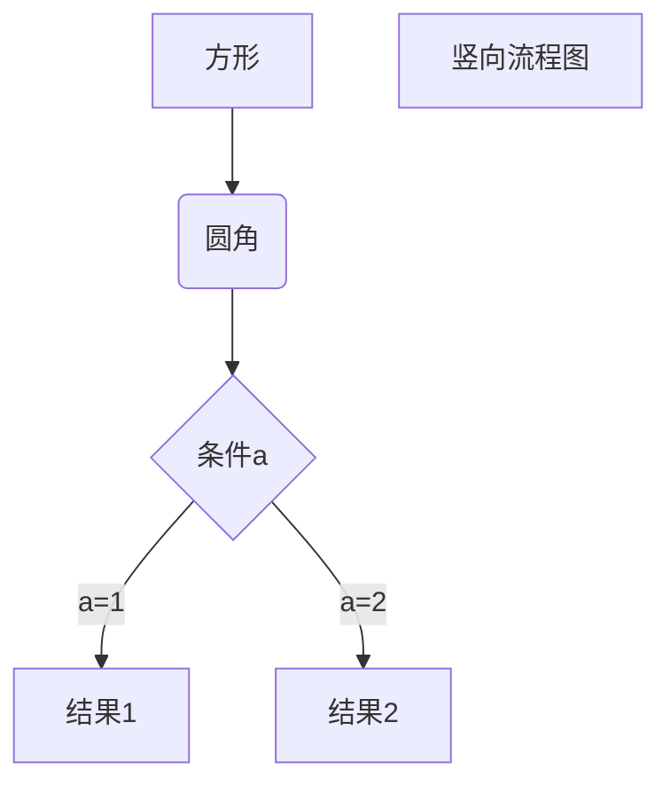

<meta charset="utf-8">
<meta name="viewport" content="width=device-width, initial-scale=1.0, user-scalable=yes">
<style>
h1,
h2,
h3,
h4,
h5,
h6,
p,
blockquote {
    margin: 0;
    padding: 0;
}
body {
    font-family: "Helvetica Neue", Helvetica, "Hiragino Sans GB", Arial, sans-serif;
    font-size: 13px;
    line-height: 18px;
    color: #737373;
    background-color: white;
    margin: 10px 13px 10px 13px;
}
table {
    margin: 10px 0 15px 0;
    border-collapse: collapse;
}
td,th { 
    border: 1px solid #ddd;
    padding: 3px 10px;
}
th {
    padding: 5px 10px;  
}

a {
    color: #0069d6;
}
a:hover {
    color: #0050a3;
    text-decoration: none;
}
a img {
    border: none;
	align: center;
}
p {
    margin-bottom: 9px;
}
h1,
h2,
h3,
h4,
h5,
h6 {
    color: #404040;
    line-height: 36px;
}
h1 {
    margin-bottom: 18px;
    font-size: 30px;
}
h2 {
    font-size: 24px;
}
h3 {
    font-size: 18px;
}
h4 {
    font-size: 16px;
}
h5 {
    font-size: 14px;
}
h6 {
    font-size: 13px;
}
hr {
    margin: 0 0 19px;
    border: 0;
    border-bottom: 1px solid #ccc;
}
blockquote {
    padding: 13px 13px 21px 15px;
    margin-bottom: 18px;
    font-family:georgia,serif;
    font-style: italic;
}
blockquote:before {
    content:"\201C";
    font-size:40px;
    margin-left:-10px;
    font-family:georgia,serif;
    color:#eee;
}
blockquote p {
    font-size: 14px;
    font-weight: 300;
    line-height: 18px;
    margin-bottom: 0;
    font-style: italic;
}
code, pre {
    font-family: Monaco, Andale Mono, Courier New, monospace;
}
code {
    background-color: #fee9cc;
    color: rgba(0, 0, 0, 0.75);
    padding: 1px 3px;
    font-size: 12px;
    -webkit-border-radius: 3px;
    -moz-border-radius: 3px;
    border-radius: 3px;
}
pre {
    display: block;
    padding: 14px;
    margin: 0 0 18px;
    line-height: 16px;
    font-size: 11px;
    border: 1px solid #d9d9d9;
    white-space: pre-wrap;
    word-wrap: break-word;
}
pre code {
    background-color: #fff;
    color:#737373;
    font-size: 11px;
    padding: 0;
}
sup {
    font-size: 0.83em;
    vertical-align: super;
    line-height: 0;
}
* {
    -webkit-print-color-adjust: exact;
}
@media screen and (min-width: 914px) {
    body {
        width: 854px;
        margin:10px auto;
    }
}
@media print {
    body,code,pre code,h1,h2,h3,h4,h5,h6 {
        color: black;
    }
    table, pre {
        page-break-inside: avoid;
    }
}
</style>


# TEST123

## 1 项目创建

### maven
```
mvn archetype:create(generate) -DgroupId=org.seckill
                       -DartifactId=seckill
                       -DarchetypeArtifactId=maven-archetype-webapp
```
### 修改servlet版本为3.1
找到 apache-tomcat-8.0.45\webapps\examples\WEB-INF\web.xml,复制它的头文件，粘贴到项目的web.xml

```xml
<web-app xmlns="http://xmlns.jcp.org/xml/ns/javaee"
         xmlns:xsi="http://www.w3.org/2001/XMLSchema-instance"
         xsi:schemaLocation="http://xmlns.jcp.org/xml/ns/javaee
                      http://xmlns.jcp.org/xml/ns/javaee/web-app_3_1.xsd"
         version="3.1"
         metadata-complete="true">

</web-app>
```
### 添加目录
file->project structure->module


添加源码文件夹和测试文件夹

## 2 依赖
junit依赖更改为4.12

### 日志
slf4j是接口，日志实现为：log4j,logback,common-logging

使用：slf4j + logback

```xml
<dependency>
  <groupId>org.slf4j</groupId>
  <artifactId>slf4j-api</artifactId>
  <version>1.7.12</version>
</dependency>

<dependency>
  <groupId>ch.qos.logback</groupId>
  <artifactId>logback-core</artifactId>
  <version>1.1.11</version>
</dependency>

<!-- 实现slf4j接口并整合 -->
<dependency>
  <groupId>ch.qos.logback</groupId>
  <artifactId>logback-classic</artifactId>
  <version>1.1.11</version>
</dependency>
```
### 数据库依赖

```
<dependency>
  <groupId>mysql</groupId>
  <artifactId>mysql-connector-java</artifactId>
  <version>5.1.42</version>
  <scope>runtime</scope>  <!--只在连接时工作-->
</dependency>
<!-- 数据库连接池 -->
<dependency>
  <groupId>c3p0</groupId>
  <artifactId>c3p0</artifactId>
  <version>0.9.1.2</version>
</dependency>
```

### DAO层 MyBatis

```
<!-- DAO框架：MyBatis -->
<dependency>
  <groupId>org.mybatis</groupId>
  <artifactId>mybatis</artifactId>
  <version>3.4.0</version>
</dependency>
<!-- mybatis自身实现的spring整合依赖 -->
<dependency>
  <groupId>org.mybatis</groupId>
  <artifactId>mybatis-spring</artifactId>
  <version>1.3.0</version>
</dependency>
```
### javaweb相关依赖

```xml
<!-- Servlet web相关依赖-->
    <dependency>
      <groupId>taglibs</groupId>
      <artifactId>standard</artifactId>
      <version>1.1.2</version>
    </dependency>
    <dependency>
      <groupId>jstl</groupId>
      <artifactId>jstl</artifactId>
      <version>1.2</version>
    </dependency>
    <dependency>
      <groupId>com.fasterxml.jackson.core</groupId>
      <artifactId>jackson-databind</artifactId>
      <version>2.8.8</version>
    </dependency>
    <dependency>
      <groupId>javax.servlet</groupId>
      <artifactId>javax.servlet-api</artifactId>
      <version>3.1.0</version>
    </dependency>
```

### Spring依赖

```
<!--Spring依赖-->
    <!--Spring核心依赖-->
    <dependency>
      <groupId>org.springframework</groupId>
      <artifactId>spring-core</artifactId>
      <version>4.3.9.RELEASE</version>
    </dependency>
    <dependency>
      <groupId>org.springframework</groupId>
      <artifactId>spring-beans</artifactId>
      <version>4.3.9.RELEASE</version>
    </dependency>
    <dependency>
      <groupId>org.springframework</groupId>
      <artifactId>spring-context</artifactId>
      <version>4.3.9.RELEASE</version>
    </dependency>
    <!--Spring dao层依赖-->
    <dependency>
      <groupId>org.springframework</groupId>
      <artifactId>spring-jdbc</artifactId>
      <version>4.3.9.RELEASE</version>
    </dependency>
    <dependency>
      <groupId>org.springframework</groupId>
      <artifactId>spring-tx</artifactId> <!--Spring 声明式事务-->
      <version>4.3.9.RELEASE</version>
    </dependency>
    <!--Spring web相关依赖-->
    <dependency>
      <groupId>org.springframework</groupId>
      <artifactId>spring-web</artifactId>
      <version>4.3.9.RELEASE</version>
    </dependency>
    <dependency>
      <groupId>org.springframework</groupId>
      <artifactId>spring-webmvc</artifactId>
      <version>4.3.9.RELEASE</version>
    </dependency>
    <!--Spring test依赖-->
    <dependency>
      <groupId>org.springframework</groupId>
      <artifactId>spring-test</artifactId>
      <version>4.3.9.RELEASE</version>
    </dependency>
```


```flow
st=>start: Start
op=>operation: Your Operation
cond=>condition: Yes or No?
e=>end

st->op->cond
cond(yes)->e
cond(no)->op
```



```sequence
Alice->Bob: Hello Bob, how are you?
Note right of Bob: Bob thinks
Bob-->Alice: I am good thanks!
```


asdasd

1. asd

2. sadas

   asdas

3. sadsa

   asdsa

   asdsa

   asdsa

asdsa

- [ ] asdsad
- [ ] asdasd
- [ ] wesrfwe

```

```

